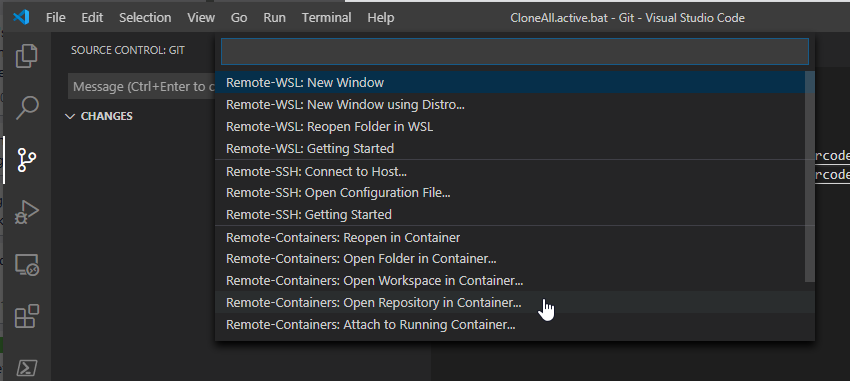

# Devcontainer

## How to use this workspace template

Click on "Open Repository in Container":

And copy in the https url of this repo: https://github.com/geircode/setting-up-ghost-in-azure

This will create a container and clone this repository into the container with the credentials you used to clone the repository locally.

### Do not use Volume Mounts in Windows

I try to avoid using Volume Mounts that mounts the local filesystem into the container, because this is always the biggest PAIN when setting up any workshop with alot of other peoples laptops with different setups and network policy limitations. Volume mounts in Windows also changes the file access permissions and forces strange LF/CR and LF problems when opening files.

https://code.visualstudio.com/docs/remote/containers-advanced#_a-basic-remote-example

*In fact, the **Remote-Containers: Open Repository in Container...** command in the Command Palette (F1) uses this same technique. If you already have a `devcontainer.json` file in a GitHub repository that references an image or Dockerfile, the command will automatically use a named volume instead of a bind mount - which also works with remote hosts.*

Named volumes are ok since they do not depend on volume mounting to local network paths.

